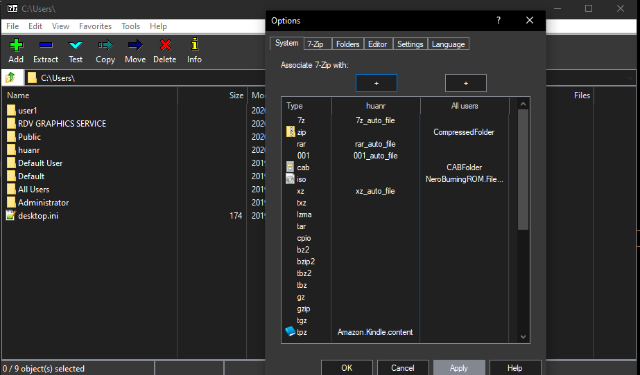

# 7zipDarkmode

inspired by https://github.com/ysc3839/win32-darkmode/tree/master/win32-darkmode

and https://github.com/Nukem9/SkyrimSETest	(starting from 0.04)

Only work on Win10 which means that the menu also supports dark mode. After version 0.04 there might be some visual issues if you open file properties in the 7zipFM.

Download link: https://github.com/renfenghuan/7zipDarkmode/releases

Once downloaded, replace the 7zipFM.exe in the installation directory with my new exe.

## How To Compile 

Download 7zip Source code https://sourceforge.net/projects/sevenzip/

I used 7zip 19 version. But I only changed some of the UI codes. I think it's possible that one can use my files to compile newer versions.

use Nukem9's https://github.com/Nukem9/detours Project to compile detours.lib with compiler setting /Gr

and copy detours.lib to CPP\7zip\Bundles\Fm

copy my files to the 7zip source folder, replace the old files, and compile.

Read this first.
	http://www.ski-epic.com/2012_compiling_7zip_on_windows_with_visual_studio_10/index.html

turns out it uses nmake to compile
	
open "Developer Command Prompt for VS 2017"

	cd C:\my7zip\CPP\7zip\Bundles\Fm
	nmake

compiled file is in 

	C:\my7zip\CPP\7zip\Bundles\Fm\O\7FM.exe
	
	
	
## ///////////////// Change ///////////////////////////

edited

	CPP\7zip\UI\FileManager\FM.cpp, Cpp\Build.mak, CPP\7zip\UI\FileManager\FM.mak
	
	CPP\7zip\UI\FileManager\StdAfx.h
		#define _WIN32_WINNT 0x0600
		
	CPP\7zip\UI\FileManager\Panel.cpp
		CMyListView::OnMessage
		
	Panel.h
		add header files
		
Added
	IatHook.h, DarkMode.h，IatHook.cpp, Darkmode.cpp, Detours.h, EditorUIDarkMode.h, EditorUIDarkMode.cpp
	(Many files come from links I mentioned, but I edited many contents.)
